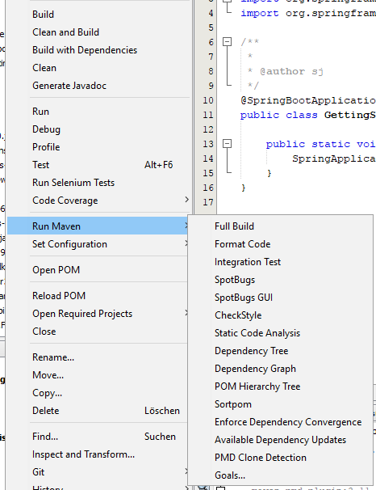

# Spring Boot 2 Netbeans Getting Started

## Usage

Just clone the repository and you're ready to go. You'll get a nice template for an empty Spring Boot 2 application.

## Prerequisites
1. recent JDK 8
1. recent Maven
1. Netbeans >= 8.2
1. `mvn clean install` in `skip-execution-profile/maven-skip-execution-profile-extension` directory

## Features

Highly opinionated selection of Maven plugins made accessible via the Netbeans UI.
The two projects in `spring-boot-netbeans-single-module` and `spring-boot-netbeans-multi-module` can be used as templates.

- **[Build]** `install` with `resources:[test]Resources` and `compiler:[test]Compile` only
- **[Clean and Build]** `clean install` with `resources:[test]Resources` and `compiler:[test]Compile` only
- **[Run]** `spring-boot:run`
- **[Debug]** `spring-boot:run` with debugger attached
- Run Maven
  - **[Full Build]** a full `clean install` with verification
  - **[Format Code]** `formatter:format` according to `eclipse-formatter-config.xml` and `impsort:sort`  
  - **[Integration Test]** `failsafe:integration-test`
  - **[SpotBugs]** `spotbugs:check`
  - **[SpotBugs GUI]** `spotbugs:gui`
  - **[Checkstyle]** `checkstyle:check` for checking Cyclomatic Complexity
  - **[Static Code Analysis]** `spotbugs:check`, `checkstyle:check` and `pmd:cpd-check` 
  - **[Dependency Tree]** `dependency:tree`
  - **[Dependency Graph]** `depgraph:graph`
  - **[POM Hierarchy Tree]** `hierarchy:tree`
  - **[Sortpom]** `sortpom:sorty`
  - **[Enforce Dependency Convergence]** `enforcer:enforce@dependency-convergence`
  - **[Available Dependency Updates]** `versions:display-dependency-updates`
  - **[PMD Clone Detection]** `pmd:cpd-check`

  **Note**: In order to speed up the IDE actions as much as possible **[Run]**, **[Debug]**, and **[Test]** are even skipping `resources:[test]Resources` and `compiler:[test]Compile` and simply use the current contents of the `target` directory.
  This is done with the `maven-skip-execution-profile-extension` that automatically creates the profiles needed for skipping certain plugins for certain actions.