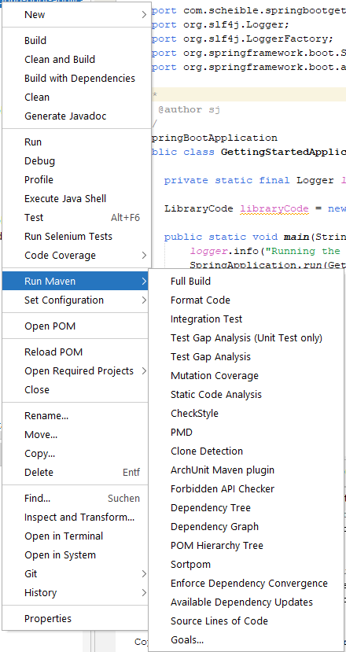

# Spring Boot 3 Netbeans Getting Started

## Usage

Just clone the repository and you're ready to go (please see prerequisites section). You'll get a nice template for an empty Spring Boot 3 application.

## Features

Highly opinionated build with selection of Maven plugins made accessible via the Netbeans UI.
See section 'Source code style' for more information about the coding style.
The two projects in `spring-boot-netbeans-single-module` and `spring-boot-netbeans-multi-module` can be used as templates.
Both projects use `${revision}` for setting the version which can be overridden at build time from the outside.

 In order to speed up the IDE actions as much as possible **[Run]**, **[Debug]**, and **[Test]** are even skipping `resources:[test]Resources` and `compiler:[test]Compile` and simply use the current contents of the `target` directory.
This is done with the `maven-skip-execution-profile-extension` that automatically creates the (runtime) profiles needed for skipping certain plugins actions.
The profiles don't end up in the actual POM.

- **[Build]** `install` with `resources:[test]Resources` and `compiler:[test]Compile` only
- **[Clean and Build]** `clean install` with `resources:[test]Resources` and `compiler:[test]Compile` only
- **[Run]** `spring-boot:run`
- **[Debug]** `spring-boot:run` with debugger attached
- Run Maven
  - **[Full Build]** a full `clean install` with verification
  - **[Format Code]** `formatter:format` according to `eclipse-formatter-config.xml` and `impsort:sort`  
  - **[Integration Test]** `failsafe:integration-test`
  - **[Test Gap Analysis (Unit Test only)]** `test-gap-analysis:perform` of current working tree changes with unit tests only
  - **[Test Gap Analysis]** `test-gap-analysis:perform` of current working tree changes with unit and integration tests 
  - **[Mutation Coverage]** `pitest-maven:mutationCoverage` of unit tests only
  - **[Static Code Analysis]** `spotbugs:check`, `checkstyle:check`, `pmd:check`, `pmd:cpd-check` and `arch-unit:arch-test`
  - **[SpotBugs]** `spotbugs:check`
  - **[SpotBugs GUI]** `spotbugs:gui`
  - **[Checkstyle]** `checkstyle:check` for among others checking the metrics [Cyclomatic Complexity](https://checkstyle.org/config_metrics.html#CyclomaticComplexity) and [NCSS](https://checkstyle.org/config_metrics.html#JavaNCSS)
  - **[PMD]** `pmd:check`
  - **[Clone Detection]** `pmd:cpd-check`
  - **[ArchUnit Maven plugin]** `arch-unit:arch-test` 
  - **[Dependency Tree]** `dependency:tree`
  - **[Dependency Graph]** `depgraph:graph`
  - **[POM Hierarchy Tree]** `hierarchy:tree`
  - **[Sortpom]** `sortpom:sorty`
  - **[Enforce Dependency Convergence]** `enforcer:enforce@dependency-convergence`
  - **[Available Dependency Updates]** `versions:display-dependency-updates`
  - **[Source Lines of Code]** `sloc-maven-plugin:sloc`
  - **[PIT Mutation Test]** `pitest-maven:mutationCoverage` with report generation
  
## Prerequisites
1. at least JDK 17
1. recent Maven (tested with 3.8.6)
1. Netbeans >= 15
1. `mvn clean install` in `skip-execution-profile/maven-skip-execution-profile-extension` directory of the repository
1. `mvn clean install` of [Pocketsaw 1.5.1](https://github.com/janScheible/pocketsaw/tree/1.5.1)
1. **[optional]** [External Code Formatters for NetBeans](https://funfried.github.io/externalcodeformatter_for_netbeans/) plugin >= 1.14.0 to use the Eclipse Formatter directly in the IDE
1. **[optional]** `mvn clean install` of [Test Gap Analysis 1.2.1](https://github.com/janScheible/test-gap-analysis/tree/1.2.1)

## Source code style
1. avoid `static` methods for easier testing
    1. exception: (package) private helper methods in classes that are static to enforce functional purity
    1. exception: completely stateless `*Utils` classes with static methods only
        1. utility classes must be `abstract` and have a private default constructor
    1. exception: real constants with names in upper case delimited by underscores (real constants are either primitive or immutable instances that are never used together with a `"."` to access one of their members)
1. `logger` has to be: `private static final Logger logger = LoggerFactory.getLogger(getClass());` (see https://www.slf4j.org/faq.html#declared_static for no conclusion... 😉)
1. restrict file, method and lambda lengths to reasonable values
1. code dependency
    1. no code cycles on package level
    1. no dependencies between a package and any of its (sub-)sub-packages (only the other way around)
1. restrict maximal number of parameters to a reasonable value
    1. in case of model class constructors with too many parameters use a http://rdafbn.blogspot.com/2012/07/step-builder-pattern_28.html
        1. extra abstract class with `<ModelClassName>Builder` name and private default constructor
        1. static `builder()` method in model class as only way to instantiate the class
        1. (package private) constructor in model class with `BuilderImpl` as only parameter
        1. inner step interfaces in `<ModelClassName>Builder` with `Step` suffix
        1. inner static class `BuilderImpl` implementing all the steps
1. usage of immutable data structures only by making all members `final`
    1. usage of Java records when ever possible
    1. for members of type collection defensive copies and `Collections.unmodifiableXzy(...)` in constructor
        1. the elements in the collections must also be immutable
    1. local variables and parameters must not use `final` because it adds too much noise (see https://github.com/spring-io/spring-javaformat#final)
        1. only ever mutate parameters in `private` methods (for example recursive methods), for all other methods return proper result types
1. usage of `Optional<?>` (was actually designed for method return types only, but is the only JDK built-in way to indicate a nullable value (all `@Nullable` annotations are from third-party libraries))
    1. never pass or return `null`, use `Optional<?>` instead (this eliminates the need for `null` checks everywhere)
    1. but prefer method overloading or usage of a builder over `Optional<?>` method parameters
    1. even use `Optional<?>` for class fields (avoids unnecessary `Optional.ofNullable(...)` calls in getter of immutable objects)
1. Java source file organization (derived from https://github.com/spring-projects/spring-framework/wiki/Code-Style#java-source-file-organization)
    1. `enum` types if simple ones (contains only constants)
    1. `static` fields and initializers
    1. normal fields
    1. constructors (ordering of parameters should be consistent with the order of the corresponding fields)
    1. `static` factory methods
    1. all other methods
        1. overridden methods have to be grouped together
    1. getters and setters (ordering of fields and getters/setters should be consistent with order of the corresponding fields)
    1. `equals(...)`, `hashCode()` and `toString()`
    1. inner types (`static`/inner classes, `interface` and non-simple `enum` types)
        1. don't overuse inner types, as soon as the type is also useful in some other context it should be a top-level type
1. don't use checked (and unchecked) exceptions for program flow, always prefer returning proper result types (exceptions are reserved for real, unexpected errors)
    1. usage of the `Result` type of `com.spencerwi:Either.java` to return either a return type or the exception that happened
    1. wrapping an `IOException` with `UncheckedIOException` (or more general any exception in a `IllegalStateException`) is okay but takes away the possibility from the caller to react to errors (for example by skipping a single file that cause an `IOException` while reading it)
1. no static imports in production code (only allowed in tests)
1. no wildcard imports in general
1. `equals(...)`, `hashCode()` and `toString()` must be implemented for all model/domain classes but not service or utility classes
    1. `toString()` should only be used for debugging purposes (printed in logs (`DEBUG` level) or in IDE) and never use to extract the state of an object
    1. `toString()` should contain all interesting information (too long information can be shorten or summarized)
    1. on high-level `equals(...)` must first test for identity (`==`) and then for type compatibility with `instanceof`
    1. `equals(...)` must compare different type of fields differently:
        1. `float` and `double` with `Float.compare(...)` resp. `Double.compare(...)`
        1. all other primitive types and enums with `==`
        1. object references with `Objects.equals(...)`
    1. `hashCode()` must use `Objects.hash(...)`
1. always use `this.` for class fields but never for instance methods (same approach as https://github.com/spring-projects/spring-framework/wiki/Code-Style#field-and-method-references)
1. `static` fields and methods of own class must never be prefixed with the own class name
1. usage of Java Stream API
    1. don't overuse lambdas with streams, prefer method references or simple one line lambdas
    1. usage of `forEach` with `stream()` is suspicious, should only be used in rare cases with a method reference (good old for-each loops might be easier to read and debug)
1. no usage of `var` at all because the diamond operator does a good enough job (the Spring teams agrees: https://github.com/spring-projects/spring-framework/wiki/Code-Style#local-variable-type-inference)